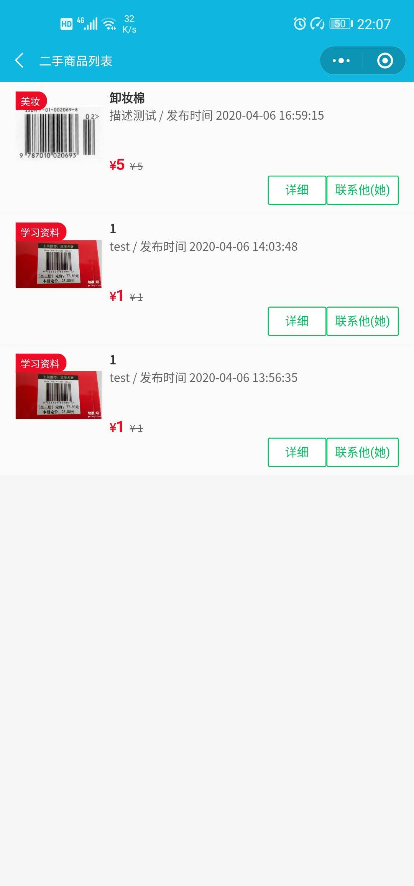

# tcb-hackthon-secondHand

## 项目名称：武院二手交易

## 介绍

基于小程序和[云开发](https://cloud.tencent.com/product/tcb?from=10680)搭建。

因为小程序的云开发不需要额外部署服务器，大大降低了开发者的开发成本。

是本人参与腾讯布道师培训完成的一个项目，主要在于解决校园二手物品的问题，数据存储使用小程序云开发功能，全套程序已开源在[gitee](https://gitee.com/leidb/tcb-hackthon-secondHand/)主页。

## 背景			

此小程序主要是服务于当前大学生，解决大学生在校园存在资源冗余问题，将学生二手资源买卖给学生，实行C2C模式，降低学生的生活成本。例如：师兄师姐毕业时要处理的课本，已经经历过考研、考公务员、考资格证的学生的学习资料，学生疯狂网购买了很多用不到的物品等。

## 三大优势

* 充分利用冗余资源，推崇绿色消费。

* 方便快捷，可以去掉物流这以一环节，直接联系卖家获取商品即可。

* 安全性高：通过校园认证，确认身份，保证学生交易的安全性。

对于书籍类二手物品可以通过扫一扫一维码即可展示商品信息，操作简单。具有商品分类功能，帮助学生快速找到有需求的物品，注重用户体验。

# 设计思路

一开始就决定基于小程序和云开发搭建。

小程序本身的即用即走以及订阅通知机制非常适合我的应用场景。

而云开发所倡导的 serverless 也是我一直非常感兴趣和愿意尝试的，在这种轻量级应用中非常合适。

# **技术架构**

## **小程序框架**

采用云开发加云储存加云数据库模式。

## **小程序ui**

采用了Vant Weapp 轻量、可靠的小程序 UI 组件库。

Vant Weapp 是移动端 Vue 组件库[Vant](https://github.com/youzan/vant)的小程序版本，两者基于相同的视觉规范，提供一致的 API 接口，助力开发者快速搭建小程序应用。

`最直接的功能就是一键电话联系对方`

#### 项目效果截图

#### 本程序完全开源[https://gitee.com/leidb/tcb-hackthon-secondHand/blob/master/LICENSE]

#### 安装教程和使用说明

1. 直接下载到本地，然后导入开发者工具

   > https://gitee.com/leidb/tcb-hackthon-secondHand.git
   >
   > 小程序开发综合文档地址：[https://developers.weixin.qq.com/miniprogram/dev/framework/](https://developers.weixin.qq.com/miniprogram/dev/framework/ "https://developers.weixin.qq.com/miniprogram/dev/framework/")

2. 开通云环境

   > 云开发官方文档说明：[https://developers.weixin.qq.com/miniprogram/dev/wxcloud/basis/getting-started.html](https://developers.weixin.qq.com/miniprogram/dev/wxcloud/basis/getting-started.html "https://developers.weixin.qq.com/miniprogram/dev/wxcloud/basis/getting-started.html")

3. 修改部分配置信息

   	"appid": "你自己的appid",
      	    env: '你自己的云环境id',

4. 进去云函数目录 安装所需要的模块 终端输入npm install

5. 创建云数据库 books,sh_user,sh_items,并把数据库权限设置为`所有用户可读，仅创建者可读写`

6. | 集合名称 | 存储内容 |
   | -------- | -------- |
   | books    | 书籍信息 |
   | sh_user  | 用户信息 |
   | sh_items | 商品信息 |

7. banner的轮播图为云储存里面的图片，需自备

   

#### 

#### 参与贡献

1.  Fork 本仓库
2.  新建 Feat_xxx 分支
3.  提交代码
4.  新建 Pull Request

#### 码云特技

1.  使用 Readme\_XXX.md 来支持不同的语言，例如 Readme\_en.md, Readme\_zh.md
2.  码云官方博客 [blog.gitee.com](https://blog.gitee.com)
3.  你可以 [https://gitee.com/explore](https://gitee.com/explore) 这个地址来了解码云上的优秀开源项目
4.  [GVP](https://gitee.com/gvp) 全称是码云最有价值开源项目，是码云综合评定出的优秀开源项目
5.  码云官方提供的使用手册 [https://gitee.com/help](https://gitee.com/help)
6.  码云封面人物是一档用来展示码云会员风采的栏目 [https://gitee.com/gitee-stars/](https://gitee.com/gitee-stars/)
